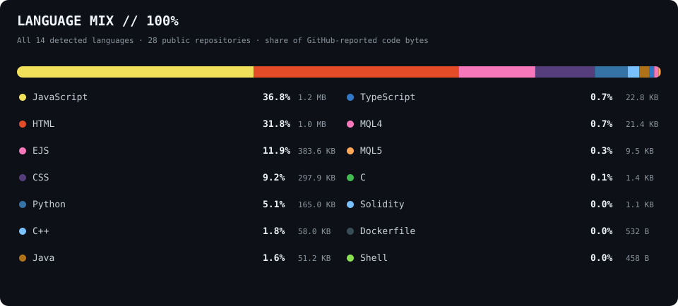

## Bitcoin daily price & latest news

Last completed BTC/USDT daily candle and the latest Bitcoin article from the news feed used by my [BTC price and news monitor](https://github.com/iiwiiInsider/Bitcoin_Price_And_News_Notifiyer):

## All repository languages

Language shares are calculated from GitHub's code-byte totals across all my public repositories. Every detected language is included and the percentages add up to 100%.

## Repository activity

Latest commits and GitHub Actions runs across my 25 most recently updated public repositories:

## Commit pulse

Recent public push activity visible in GitHub's most recent 300 events:

The dashboard refreshes daily and whenever its generator changes. BTC/USDT daily candles are sourced from Binance; the latest article is fetched from the Google News RSS feed used by my BTC monitor.
