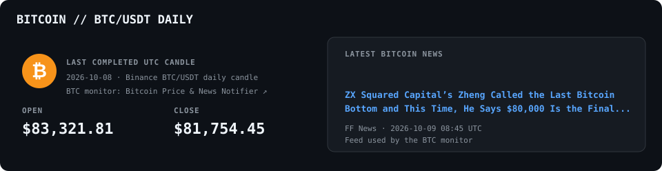
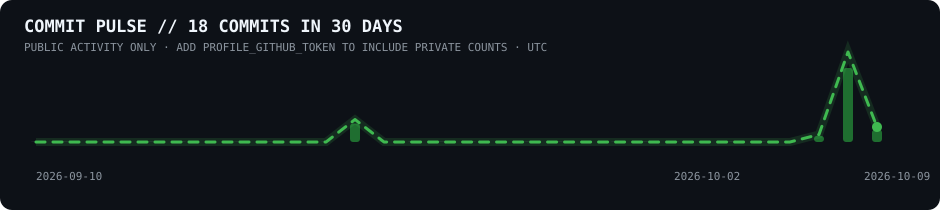

## Bitcoin daily price & latest news

Last completed BTC/USD daily candle and the latest Bitcoin article from the news feed used by my [BTC price and news monitor](https://github.com/iiwiiInsider/Bitcoin_Price_And_News_Notifiyer):

## All repository languages

Language shares are calculated from GitHub's code-byte totals across all my public repositories. Every detected language is included and the percentages add up to 100%.

## Repository activity

Latest commits and GitHub Actions runs across my 25 most recently updated public repositories:

## Commit pulse

Recent commit activity in UTC. When `PROFILE_GITHUB_TOKEN` is configured, private repository commits are included as aggregate counts only; no private repository names or commit messages are shown:

The dashboard refreshes daily and whenever its generator changes. BTC/USD daily candles are sourced from Kraken; the latest article is fetched from the Google News RSS feed used by my BTC monitor.

To include private repository commit counts in the pulse, add a fine-grained personal access token as the `PROFILE_GITHUB_TOKEN` Actions secret. Give it access to all private repositories whose counts should be included and grant read-only **Contents** access. Without this secret, the pulse shows public activity only. Private repository names and commit messages are never included in the public chart.
